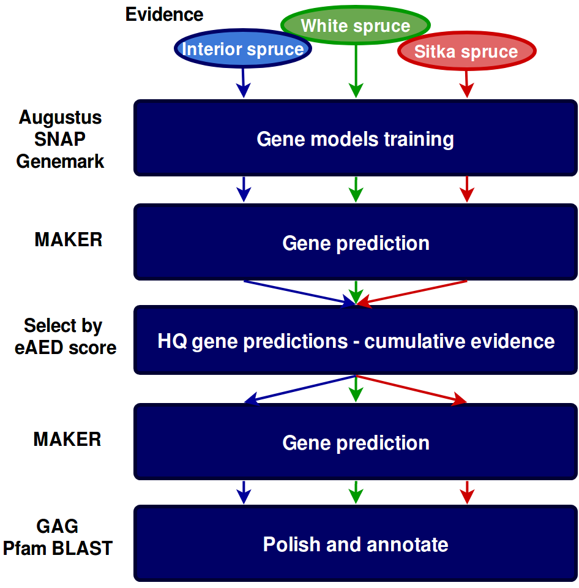

# Spruce Genome Annotation

Annotate spruce draf genome assembly.     

* MAKER is run in several iterations for refinement and results improvement
* The gene models are trained for each species through an initial run of MAKER. Species-specific evidence is used for each model
* The models are used for the first pass of gene prediction
* The predicted genes are filtered for eAED score < 1 and used as evidence for the final run of MAKER together with the HQ cDNA and proteins
* The final gene set is annotated by assigning functional domains and aligning to know plant proteins

Poster presented at Plant and Animal Genome 2019 - San Diego - CA

